# Praktikum Sistem Operasi Modul 3 - IT17

## Anggota Kelompok

| NRP        | Nama                            |
|:----------:|:-------------------------------:|
| 5027241006 | Nabilah Anindya Paramesti       |
| 5027241092 | Muhammad Khairul Yahya          |
| 5027241002 | Balqis Sani Sabillah            |


## Daftar Isi

- [Soal 1](#soal-1)
- [Soal 2](#soal-2)
- [Soal 3](#soal-3)
- [Soal 4](#soal-4)

# Soal 1
_**Oleh : Nabilah Anindya Paramesti**_

## Deskripsi Soal
Karena anda adalah seorang professional programmer, anda mengikuti petunjuk yang anda dapatkan dari deep web untuk membuat **sistem RPC server-client untuk mengubah text file sehingga bisa dilihat dalam bentuk file jpeg**.

## Jawaban
### A. Download dan Unzip file txt
Text file rahasia terdapat pada [LINK INI](https://drive.google.com/file/d/15mnXpYUimVP1F5Df7qd_Ahbjor3o1cVw/view?usp=sharing), diperbolehkan untuk download/unzip secara manual

### Penyelesaian A
aa

### B. Membuat image_client.c (daemon)
Pada image_server.c, program yang dibuat harus berjalan secara daemon di background dan terhubung dengan image_client.c melalui socket RPC.

### Penyelesaian B
aa

### C. Membuat `image_client.c` dan `image_server.c` terhubung
Program `image_client.c` harus bisa terhubung dengan `image_server.c` dan bisa mengirimkan perintah untuk:
- Decrypt text file yang dimasukkan dengan cara **Reverse Text lalu Decode from Hex**, untuk disimpan dalam folder database server dengan nama file berupa **timestamp** dalam bentuk angka, misalnya: `database/1744401282.jpeg`
- Request download dari database server sesuai filename yang dimasukkan, misalnya: `1744401282.jpeg`
- **Note: tidak diperbolehkan copy/pindah file, gunakan RPC untuk mengirim data.**

### Penyelesaian C
aa

### D. Membuat menu `image_client.c`
Program i`mage_client.c` harus disajikan dalam bentuk menu kreatif yang memperbolehkan pengguna untuk memasukkan perintah berkali-kali.

### Penyelesaian D
aa

### E. Dapat mengirim text file dan menerima file jpeg
Program dianggap berhasil bila pengguna dapat mengirimkan text file dan menerima sebuah file jpeg yang dapat dilihat isinya.

### Penyelesaian E
aa


### F. Menangani Error
Program `image_server.c` diharuskan untuk tidak keluar/terminate saat terjadi error dan client akan menerima error message sebagai response, yang meliputi minimal:
- Dari Client:
  - Gagal connect ke server
  - Salah nama text file input
- Dari Server:
  - Gagal menemukan file untuk dikirim ke client

### Penyelesaian F
aa

### G. Menyimpan ke log file
Server menyimpan log semua percakapan antara image_server.c dan image_client.c di dalam file server.log dengan format:
```
[Source][YYYY-MM-DD hh:mm:ss]: [ACTION] [Info]
# Contoh:
[Client][2025-03-12 02:23:17]: [DECRYPT] [Text data] 
[Server][2025-03-12 02:23:17]: [SAVE] [1744399397.jpeg] 
[Client][2025-03-12 02:23:26]: [DOWNLOAD] [1744399397.jpeg] 
[Server][2025-03-12 02:23:26]: [UPLOAD] [1744399397.jpeg] 
[Client][2025-03-12 02:23:31]: [DECRYPT] [Text data] 
[Server][2025-03-12 02:23:31]: [SAVE] [1744399411.jpeg] 
[Client][2025-03-12 02:23:38]: [DOWNLOAD] [1744399411.jpeg] 
[Server][2025-03-12 02:23:38]: [UPLOAD] [1744399411.jpeg] 
[Client][2025-03-12 02:23:39]: [EXIT] [Client requested to exit]
```

### Penyelesaian G
aa

### Dokumentasi Soal 1
- Menjalankan `image_server` dan port connect

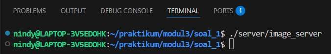

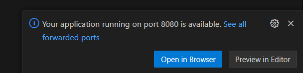

- Menjalankan image_client dan download file txt

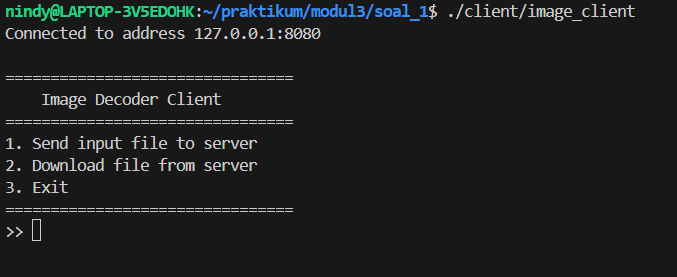

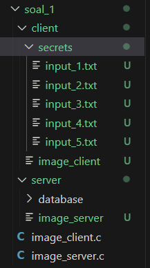

- Decrypt dan download serta upload

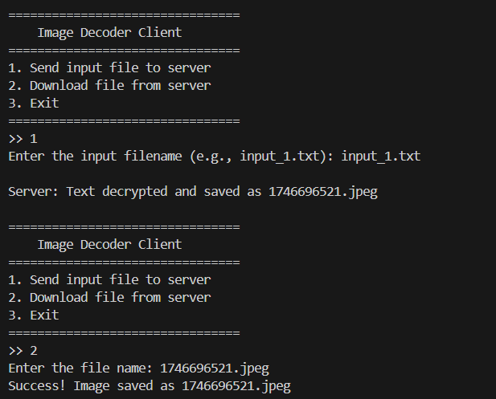

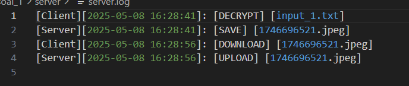

- Gambar berhasil ter-decrypt dan tampil

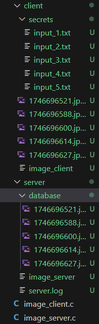

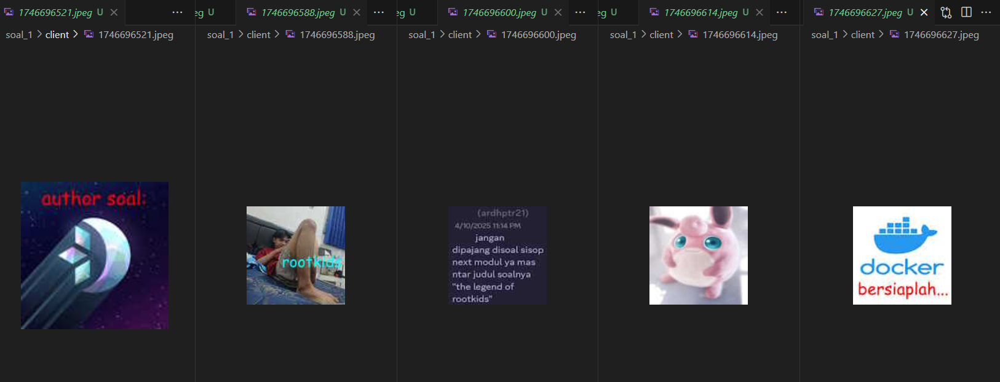

- Exit Menu

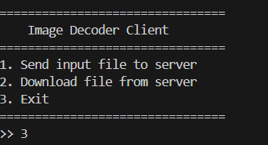

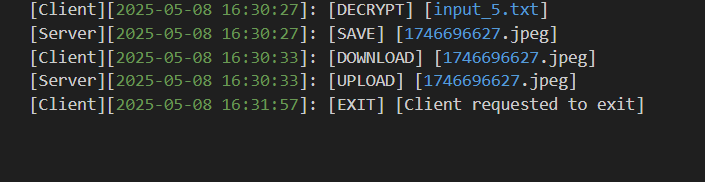

# Soal 2  
*Oleh : Balqis Sani Sabillah*

## Deskripsi Soal ## 
1. Tahun 2025, di tengah era perdagangan serba cepat, berdirilah
sebuah perusahaan ekspedisi baru bernama RushGo. RushGo ingin
memberikan layanan ekspedisi terbaik dengan 2 pilihan, Express
(super cepat) dan Reguler (standar). Namun, pesanan yang masuk
sangat banyak! Mereka butuh sebuah sistem otomatisasi
pengiriman, agar agen-agen mereka tidak kewalahan menangani
pesanan yang terus berdatangan. Kamu ditantang untuk
membangun Delivery Management System untuk RushGo (Author:
Nayla / naylaarr)
Sistem ini terdiri dari dua bagian utama:
- delivery_agent.c untuk agen otomatis pengantar Express
- dispatcher.c untuk pengiriman dan monitoring pesanan oleh user

## Soal A ##
a. Mengunduh File Order dan Menyimpannya ke Shared Memory
Untuk memulai, Anda perlu mengelola semua orderan yang
masuk dengan menggunakan shared memory.
● Unduh file delivery_order.csv
● Setelah file CSV diunduh, program Anda harus membaca
seluruh data dari CSV dan menyimpannya ke dalam
shared memory.

## Jawaban ##
```  
void load_csv_to_shared_memory(const char* filename) {
    FILE *fp = fopen(filename, "r");
    if (!fp) {
        perror("Failed to open CSV");
        exit(1);
    }
    char line[200];
    while (fgets(line, sizeof(line), fp)) {
        if (sscanf(line, "%49[^,],%99[^,],%9s", orders[*order_count].nama, orders[*order_count].alamat, orders[*order_count].jenis) == 3) {
            orders[*order_count].delivered = 0;
            orders[*order_count].delivered_by[0] = '\0';
            (*order_count)++;
        }
    }
    fclose(fp);
}

```

### Keterangan ###
``` void load_csv_to_shared_memory(const char* filename) { FILE *fp = fopen(filename, "r")  ``` 
- Membuka file CSV (`delivery_order.csv`) dalam mode baca.
- Jika gagal, program akan keluar (`exit(1)`).

```     char line[200]; while (fgets(line, sizeof(line), fp))  ``` 

Membaca file baris demi baris ke dalam variabel `line`.

```         if (sscanf(line, "%49[^,],%99[^,],%9s", orders[*order_count].nama, orders[*order_count].alamat, orders[*order_count].jenis) == 3) { ``` :
Menggunakan `sscanf` untuk memecah baris CSV menjadi:
- `nama` (maks 49 karakter)
- `alamat` (maks 99 karakter)
- `jenis` (maks 9 karakter)
Nilai disimpan ke array `orders[*order_count]`

```  orders[*order_count].delivered = 0; orders[*order_count].delivered_by 0 '\0'; ```
- Menandai bahwa order belum dikirim `(delivered = 0)`
- Kosongkan `string delivered_by`

```   (*order_count)++; ```
Tambahkan jumlah order setiap kali satu baris berhasil dimuat

## Dokumentasi Soal A ##


## Soal B ##
Pengiriman Bertipe Express
RushGo memiliki tiga agen pengiriman utama: AGENT A, AGENT
B, dan AGENT C.

- Setiap agen dijalankan sebagai thread terpisah
- Agen-agen ini akan secara otomatis:
    - Mencari order bertipe Express yang belum dikirim.
    - Mengambil dan mengirimkannya tanpa intervensi user.

● Setelah sukses mengantar, program harus mencatat log
di delivery.log dengan format:

[dd/mm/yyyy hh:mm:ss] [AGENT A/B/C] Express package
delivered to [Nama] in [Alamat]

## Jawaban ##
``` const char* agent_names[AGENT_COUNT] = {"AGENT A", "AGENT B", "AGENT C"}; ```

- Mendefinisikan nama tiga agen dan akan digunakan untuk identifikasi dan pencatatan log.

``` typedef struct { int agent_id; const char* agent_name; } AgentArg; ```

- `agent_id` digunakan untuk membagi order secara adil `(misalnya: i % 3 == agent_id)`.
- `agent_name` digunakan saat mencatat `log`.

```
 void* agent_thread(void* arg) {
    AgentArg* agent = (AgentArg*)arg;
    while (1) {
        for (int i = 0; i < *order_count; i++) {
            pthread_mutex_lock(mutex);
            if (strcmp(orders[i].jenis, "Express") == 0 && !orders[i].delivered && (i % AGENT_COUNT == agent->agent_id)) {
                orders[i].delivered = 1;
                strncpy(orders[i].delivered_by, agent->agent_name, NAME_LEN);
                log_delivery(agent->agent_name, &orders[i]);
            }
            pthread_mutex_unlock(mutex);
        }
        sleep(1);
    }
    return NULL;
}
```

Fungsi ini melakukan hal berikut:
`Loop` terus-menerus mencari order `Express`.

Mengecek apakah:

- Tipe order adalah `"Express"`,
- Belum dikirim (`!orders[i].delivered`),
-Order ini tugasnya agen ini (`i % AGENT_COUNT == agent_id`).

Jika ya:
- Tandai sebagai terkirim (`delivered = 1`),
- Simpan nama `agen pengirim`,
- Panggil `log_delivery()`.

## Dokumentasi Soal B ##


## Soal C ##
Pengiriman Bertipe Reguler

Berbeda dengan Express, untuk order bertipe Reguler,
pengiriman dilakukan secara manual oleh user.

● User dapat mengirim permintaan untuk mengantar order
Reguler dengan memberikan perintah deliver dari
dispatcher.
Penggunaan:
./dispatcher -deliver [Nama]

● Pengiriman dilakukan oleh agent baru yang namanya
adalah nama user.

● Setelah sukses mengantar, program harus mencatat log
di delivery.log dengan format:

[dd/mm/yyyy hh:mm:ss] [AGENT <user>] Reguler package
delivered to [Nama] in [Alamat]

## Jawaban ##
``` void deliver_manual(const char* name, const char* user) {
    for (int i = 0; i < *order_count; i++) {
        if (strcmp(orders[i].nama, name) == 0 && strcmp(orders[i].jenis, "Reguler") == 0 && !orders[i].delivered) {
            pthread_mutex_lock(mutex);
            orders[i].delivered = 1;
            strncpy(orders[i].delivered_by, user, NAME_LEN);
            log_delivery(user, &orders[i], "Reguler");
            pthread_mutex_unlock(mutex);
            printf("Delivered Reguler order for %s by %s\n", name, user);
            return;
        }
    }
    printf("No pending Reguler order found for %s\n", name);
}
```
- Mencari order berdasarkan nama penerima dan tipe `"Reguler"`.
- Jika belum dikirim (`!orders[i].delivered`), maka:
- Tandai sebagai `delivered = 1`,
- Simpan nama pengirim `(user)`,
- Panggil `log_delivery()` dengan jenis `"Reguler"`.

## Dokumentasi Soal C ##


## Soal D ##
Mengecek Status Pesanan
Dispatcher juga harus bisa mengecek status setiap pesanan.

Penggunaan:
./dispatcher -status [Nama]

- Contoh:
Status for Valin: Delivered by Agent C
Status for Novi: Pending

## Jawaban ##
```
void check_status(const char* name) {
    for (int i = 0; i < *order_count; i++) {
        if (strcmp(orders[i].nama, name) == 0) {
            if (orders[i].delivered)
                printf("Status for %s: Delivered by %s\n", name, orders[i].delivered_by);
            else
                printf("Status for %s: Pending\n", name);
            return;
        }
    }
    printf("No order found for %s\n", name);
}
```
Fungsi ini melakukan iterasi melalui semua pesanan yang ada di shared memory.

Jika ditemukan pesanan dengan nama penerima yang sesuai:

- Jika `delivered` bernilai `1`, maka akan mencetak bahwa pesanan telah dikirim oleh agen tertentu.
- Jika `delivered` bernilai `0`, maka akan mencetak bahwa pesanan masih pending.
- Jika tidak ditemukan pesanan dengan nama tersebut, akan mencetak bahwa tidak ada pesanan yang ditemukan.

## Dokumentasi Soal D ##


## Soal E ##
```
void list_orders() {
    for (int i = 0; i < *order_count; i++) {
        printf("%s - %s\n", orders[i].nama, orders[i].delivered ? orders[i].delivered_by : "Pending");
    }
}
``` 
Fungsi ini akan mencetak setiap pesanan yang ada di shared memory.

Untuk setiap order:

- Menampilkan nama penerima `(orders[i].nama)`.
- Menampilkan status:
    Jika `orders[i].delivered == 1`, maka ditampilkan siapa yang mengantar `(orders[i].delivered_by)`.

Jika belum dikirim, akan tertulis `"Pending"`.

## Dokumentasi Soal E ##


# Soal 3
_**Oleh : Muhammad Khairul Yahya**_

## Deskripsi Soal 
Suatu pagi, anda menemukan jalan setapak yang ditumbuhi lumut dan hampir tertutup semak. Rasa penasaran membawamu mengikuti jalur itu, hingga akhirnya anda melihatnya: sebuah kastil tua, tertutup akar dan hampir runtuh, tersembunyi di tengah hutan. Gerbangnya terbuka seolah memanggilmu masuk.

Di dalam, anda menemukan pintu batu besar dengan simbol-simbol aneh yang terasa… hidup. Setelah mendorongnya dengan susah payah, anda pun menuruni tangga batu spiral yang dalam dan gelap. Di ujungnya, anda menemukan sebuah dunia baru: dungeon bawah tanah yang sudah tertinggal sangat lama.

Anda tidak tahu bagaimana anda dapat berada di situasi ini, tetapi didorong oleh rasa ingin tahu dan semangat, apa pun yang menunggumu di bawah sana, anda akan melawan.

### Cara Kerja Program???

**Lost Dungeon** menggunakan arsitektur klien-server berbasis soket TCP:

1. **Server (`dungeon.c`):**
- Berjalan pada `127.0.0.1:8888` dan menunggu koneksi dari klien.
- Menggunakan thread POSIX untuk melayani koneksi dari klien secara independen.
- Memproses perintah klien dan mengirim respons (`misalkan, untuk "1" untuk cek status pemain`).
- Menyimpan data pemain(gold, inventory, kills) dalam struktur `player` untuk setiap klien.

2. **Klien (`player.c`):**
- Terhubung ke server dan menampikan menu utama dengan opsi seperti cek status, beli senjata, atau battle.
- Mengirim perintah ke server melalui soket dan menampilkan respons server.

3. **Toko (`shop.c`):**
- Menyediakan daftar senjata dengan atribut (nama, harga, damage, passive).
- Menangani logika pembelian dan validasi (gold cukup, inventory penuh).

**Konsep Teknis:**
- **Threading:** Setiap klien ditangani dalam thread terpisah untuk mendukung multi-klien tanpa konflik data.

- **IPC/RPC:** Klien mengirim perintah ke server melalui soket, dan server memprosesnya seperti panggilan fungsi jarak jauh.

- **Warna ANSI:** Digunakan untuk meningkatkan estetika (hijau untuk bar hp, kuning untuk gold).

- **Error Handling:** Menangani input tidak valid dengan pesan yang jelas untuk pengalaman klien/user yang lebih baik.

### Soal 3-A:

**Entering the dungeon**

dungeon.c akan bekerja sebagai server yang dimana client (player.c) dapat terhubung melalui RPC. dungeon.c akan memproses segala perintah yang dikirim oleh player.c. Lebih dari 1 client dapat mengakses server.

### Jawaban 3-A
`dungeon.c` adalah server yang memungkinkan beberapa klien (`player.c`) terhubung menggunakan mekanisme RPC. Server harus menangani semua perintah klien dan mendukung lebih dari satu klien secara bersamaan.

**Penyelesaian:**

- **Soket TCP:** Server dibuat menggunakan soket TPC pada alamat `127.0.0.1:8888` dan port `8888`. Memungkinkan komunikasi 2 arah antara server & klien.

- **Thread POSIX:** Setiap klien ditangani dalam thread terpisah menggunakan `pthread_create` dan `pthread_detach`. Thread menjalankan fungsi `handle_client` untuk memproses perintah klien.

- **Stuktur `player`:** Setiap klien memiliki instance `player` yang menyimpan data seperti gold, weapon inventory, dan jumlah musuh yang dikalahkan.

- **Koneksi Klien:** `player.c` membuat soket, terhubung ke server, dan memulai interaksi dengan mengirim perintah (untuk cek status) dan menerima respons.

**Kode:**
```c
#define BUFFER_SIZE 2048
#define MAX_INVENTORY 10

typedef struct {
    char name[50];
    int price;
    int damage;
    char passive[100];
} Weapon;

typedef struct {
    int gold;
    Weapon inventory[MAX_INVENTORY];
    int inventory_count;
    int equipped_weapon_index;
    int kills;
} Player;

// dungeon.c
void *handle_client(void *arg) {
    int client_sock = *(int *)arg;
    free(arg);
    Player player = { .gold = 0, .inventory_count = 0, .kills = 0, .equipped_weapon_index = -1 };
    char buffer[BUFFER_SIZE];

    while (1) {
        int bytes_received = recv(client_sock, buffer, BUFFER_SIZE - 1, 0);
        if (bytes_received <= 0) break;
        buffer[bytes_received] = '\0';
        process_command(&player, buffer, client_sock);
    }
    close(client_sock);
    return NULL;
}

int main() {
    srand(time(NULL));
    int server_sock = socket(AF_INET, SOCK_STREAM, 0);
    struct sockaddr_in server_addr = { .sin_family = AF_INET, .sin_port = htons(8888), .sin_addr.s_addr = INADDR_ANY };
    bind(server_sock, (struct sockaddr *)&server_addr, sizeof(server_addr));
    listen(server_sock, 10);
    printf("Server berjalan, menunggu koneksi...\n");

    while (1) {
        int *client_sock = malloc(sizeof(int));
        *client_sock = accept(server_sock, NULL, NULL);
        pthread_t thread;
        pthread_create(&thread, NULL, handle_client, client_sock);
        pthread_detach(thread);
    }
    close(server_sock);
    return 0;
}
```

### Penjelasan:

- **Soket TCP:** Fungsi `socket`, `bind`, `listen`, dan `accept` digunakan untuk membuat server yang mendengarkan koneksi klien. Port `8888` dipilih untuk komunikasi local.

- **Threading:** `pthread_create` membuat thread baru untuk setiap klien, dan `pthread_detach` memastikan thread dibersihkan otomatis setelah selesai. Guna mencegah kebocoran memori.

- **Struktur `Player`:** Menyimpan data pemain seperti `gold` (awalnya 0, ~~hardcore bgt~~), `inventory` (array senjata, maks 10), `inventory_count` (jumlah senjata), `equipped_weapon_index` (indeks senjata yang digunakan, -1 jika tidak ada), dan `kills` (jumlah enemy yang dibunuh/dikalahkan).

- **Fungsi `handle_client`:** Menerima perintah klien melalui `recv`, memprosesnya dengan `prosess_command`, dan mengirim respons dengan `send`. Jika koneksi terputus (`bytes_received <= 0`), thread menutup soket dan selesai.

- **Security/Keamanan:** Menggunakan `malloc` untuk menyimpan soket klien dan `free` untuk mencegah kebocoran memori. Menggunakan `pthread_detach` untuk membersihkan thread setelah selesai. Buffer dibatas dengan `BUFFER_SIZE`(2048) untuk mencegah ***overflow***.

### Tampilan Notifikasi Server

- **Untuk Notifikasi Server sedang berjalan:**
  

- **Saat ada klien yang menggunakan game Dungeon:**
  

- **Notifikasi server terhubung dari sudut pandang klien:**
  

- **Notifikasi jika klien (lebih dari 1) menggunakan game Dungeon:**
  

### Soal 3-B

**Sightseeing**

Anda melihat disekitar dungeon dan menemukan beberapa hal yang menarik seperti toko senjata dan pintu dengan aura yang cukup seram. Ketika player.c dijalankan, ia akan terhubung ke dungeon.c dan menampilkan sebuah main menu seperti yang dicontohkan di bawah ini (tidak harus mirip, dikreasikan sesuai kreatifitas masing-masing praktikan).

###  Jawaban 3-B

**Penyelesaian**
- **Menu Utama:** Ada ASCII art, pesan sambutan, dan 5 opsi:
1. Show Player Stats
2. Shop (Buy Weapons)
3. View Inventory & Equip Weapons
4. Battle Mode
5. Exit Game

- **Interaksi Klien:** Klien mengirim perintah ke server, menerima respons, dan menampilkannya. mensimulasikan RPC, di mana klien memanggil fungsi di server.

**Kode:**
```c
// player.c
void display_menu() {
    printf("\033[32m=====================================\n");
    printf("   SELAMAT DATANG DI LOST DUNGEON   \n");
    printf("=====================================\033[0m\n");
    printf("Kau berdiri di tengah dungeon kuno.\n");
    printf("Di dekatmu ada toko senjata dan pintu seram...\n\n");
    printf("\033[1m========== MAIN MENU ==========\033[0m\n");
    printf("  1. Show Player Stats\n");
    printf("  2. Shop (Buy Weapons)\n");
    printf("  3. View Inventory & Equip Weapons\n");
    printf("  4. Battle Mode\n");
    printf("  5. Exit Game\n\n");
    printf("Choose an option: ");
}

int main() {
    int sock = socket(AF_INET, SOCK_STREAM, 0);
    struct sockaddr_in server_addr = { .sin_family = AF_INET, .sin_port = htons(8888), .sin_addr.s_addr = inet_addr("127.0.0.1") };
    if (connect(sock, (struct sockaddr *)&server_addr, sizeof(server_addr)) < 0) {
        perror("Gagal terhubung ke server");
        return 1;
    }
    printf("Terhubung ke server!\n");

    char buffer[BUFFER_SIZE];
    while (1) {
        display_menu();
        fgets(buffer, BUFFER_SIZE, stdin);
        buffer[strcspn(buffer, "\n")] = '\0';
        send(sock, buffer, strlen(buffer), 0);
        int bytes_received = recv(sock, buffer, BUFFER_SIZE - 1, 0);
        if (bytes_received <= 0) break;
        buffer[bytes_received] = '\0';
        printf("%s", buffer);
        if (strcmp(buffer, "Koneksi terputus\n") == 0) break;
    }
    close(sock);
    return 0;
}
```

### Keterangan:
- **Menu Opsi:** Opsi 1-5 dicetak dengan teks bold (`/033[1m`). Pesan naratif ("Toko senjata dan pintu seram...")

- **Koneksi Socket:** Fungsi `socket` dan `connect` menghubungkan klien ke server. Jika gagal, `perror` menampilkan pesan error.

- **Pengiriman Perintah:** `fgets` mengambil input pengguna, `strcspn` menghapus newline, dan `send` mengirim perintah ke server. Respons diterima dengan `recv` dan ditampilkan.

- **Penutupan Koneksi:** Jika server mengirim "Koneksi terputus" atau koneksi gagal (`bytes_received <=0`), klien menutup socket dan keluar.

- **Safety/Keamanan:** Buffer dibatas dengan `BUFFER_SIZE` untuk mencegah overflow, dan input dibersihkan.

### Tampilan Main Menu:


### Soal 3-C:

**Status Check**

Melihat bahwa terdapat sebuah toko senjata, anda mengecek status diri anda dengan harapan anda masih memiliki sisa uang untuk membeli senjata. Jika opsi Show Player Stats dipilih, maka program akan menunjukan Uang yang dimiliki (Jumlah dibebaskan), senjata yang sedang digunakan, Base Damage, dan jumlah musuh yang telah dimusnahkan. 

### Jawaban 3-C

**Deskripsi:** Opsi "Show Player Stats" menampilkan jumlah gold, nama senjata yang digunakan, base damage, dan jumlah enemy yg dibunuh/dikalahkan. Jika senjata memiliki efek pasif, deskripsinya juga ditampilkan.

**Penyelesaian:**

- **Status Pemain:** Ditampilkan dalam format tabel denagn warna ANSI untuk hiasan

- **Default:** Jika tidak ada senjata yang digunakan, senjata default adalah "Fists" dengan base damage 5. Gold dan kills dimulai dari 0 (~~kayak pom bensin~~).

**Kode:**
```c
// dungeon.c
void show_player_stats(Player *player, char *buffer) {
    Weapon *weapon = player->equipped_weapon_index >= 0 ? &player->inventory[player->equipped_weapon_index] : NULL;
    snprintf(buffer, BUFFER_SIZE, 
             "\033[1m======== PLAYER STATS ========\033[0m\n"
             "GOLD: \033[33m%d\033[0m  |  EQUIPPED WEAPON: %s  |  BASE DAMAGE: %d  |  KILLS: %d\n",
             player->gold, 
             weapon ? weapon->name : "Fists", 
             weapon ? weapon->damage : 5, 
             player->kills);
    if (weapon && strlen(weapon->passive) > 0) {
        char temp[BUFFER_SIZE];
        snprintf(temp, BUFFER_SIZE, "%sPASSIVE: \033[36m%s\033[0m\n", buffer, weapon->passive);
        strcpy(buffer, temp);
    }
}
```
### Keterangan:

- **Senjata Default:** jika `equipped_weapon_index < 0`, "Fists" digunakan dengan base damage 5, mencerminkan kondisi default/awal pemain.

- **Efek Pasif:** hanya ditampilkan jika senjata memiliki pasif (`strlen(weapon->passive) > 0`). Ini menangani kasus seperti "Pedang Lorem Ipsum" yang tidak memiliki pasif.

- **Security/Keamanan:** buffer sementara (`temp`) digunakan untuk menambahkan pasif, memastikan string tidak terpotong.

- **Fleksibilitas:** Fungsi ini dapat diperluas untuk menampilkan statistik lain (HP Pemain) jika diperlukan.

### Menu Status Check untuk Opsi 1:


- Ini merupakan tampilan awal pemain sebelum grinding gold.

### Soal 3-D:

**Weapon Shop**

Ternyata anda memiliki sisa uang dan langsung pergi ke toko senjata tersebut untuk membeli senjata. Terdapat 5 pilihan senjata di toko tersebut dan beberapa dari mereka memiliki passive yang unik. Disaat opsi Shop dipilih, program akan menunjukan senjata apa saja yang dapat dibeli beserta harga, damage, dan juga passive (jika ada). List senjata yang ada dan dapat dibeli beserta logic/command untuk membeli senjata tersebut diletakan di code shop.c/shop.h yang nanti akan dipakai oleh dungeon.c.

### Jawaban 3-D

**Deskripsi:** Opsi "shot" menampilkan minimal 5 senjata dengan nama, harga, damage, dan pasif (minimal 2 senjata dengan pasif). Logic toko diimplementasikan di `shop.c`. Pemain dapat membeli senjata jika gold cukup.

**Penyelesaian:**

- **Daftar Senjata:** `shop.c` mendefinisikan 10 senjata, 5 diantaranya memiliki pasif. Seperti contoh berikut:

1. **Pedang Lorem Ipsum:** 100 Gold, 10 Damage

2. **AK47:** 500 Gold, 20 Damage, +30% Crit Chance

3. **Es Krim Choco Mint:** 300 Gold, 15 Damage, +45% Poisoned

4. **Keris Hitam Pujo:** 400 Gold, 18 Damage, +15% Insta-Kill Chance

5. **Tongkat Cherybelle:** 600 Gold, 25 Damage, +58% Stun Chance

...**dan lain sebagainya**

- **Pembelian:** Pemain/klien/user memasukkan nomor senjata (1-10, 0 untuk cancel). Server memvalidasi gold dan kapasitas inventaris sebelum menambah senjata.

- **Kode:**
```c
// shop.h
typedef struct {
    char name[50];
    int price;
    int damage;
    char passive[100];
} Weapon;

// shop.c
Weapon shop[] = {
    {"Pedang Lorem Ipsum", 100, 10, ""},
    {"AK47", 500, 20, "+30% Crit Chance"},
    {"Es Krim Choco Mint", 300, 15, "+45% Poisoned"},
    {"Keris Hitam Pujo", 400, 18, "+15% Insta-Kill Chance"},
    {"Tongkat Cherybelle", 600, 25, "+58% Stun Chance"},
    {"Katana", 200, 12, ""},
    {"Busur Naga", 350, 17, ""},
    {"Kapak Perang", 450, 22, ""},
    {"Cambuk Api", 550, 23, "+20% Burn Chance"},
    {"Palu Thor", 700, 30, ""}
};

void display_shop(char *buffer) {
    snprintf(buffer, BUFFER_SIZE, "\033[1m======== WEAPON SHOP ========\033[0m\n");
    for (int i = 0; i < 10; i++) {
        char temp[BUFFER_SIZE];
        snprintf(temp, BUFFER_SIZE, "%s%d. %s - \033[33m%d Gold\033[0m, \033[31m%d Damage\033[0m%s\n",
                 buffer, i + 1, shop[i].name, shop[i].price, shop[i].damage,
                 shop[i].passive[0] ? ", \033[36mPassive: " : "");
        strcpy(buffer, temp);
        if (shop[i].passive[0]) {
            snprintf(temp, BUFFER_SIZE, "%s%s\033[0m\n", buffer, shop[i].passive);
            strcpy(buffer, temp);
        }
    }
    strcat(buffer, "\nEnter weapon number (1-10, 0 to cancel): ");
}

int buy_weapon(Player *player, int choice) {
    if (choice < 1 || choice > 10) return 0;
    Weapon *weapon = &shop[choice - 1];
    if (player->gold < weapon->price) return -1;
    if (player->inventory_count >= MAX_INVENTORY) return -2;
    player->gold -= weapon->price;
    player->inventory[player->inventory_count++] = *weapon;
    return 1;
}
```
### Keterangan:

- **Struktur `weapon`:** Menyimpan `name` (string), `price`(int), `damage`(int), dan `passive`(string). Pasif koosng (`""`) untuk senjata tanpa efek.

- **Fungsi `display_shop`:** Menggunakan `snprintf` untuk memformat daftar senjata dengan aman. warna kuning(`\033[33m`) = harga, merah(`\033[31m`) = damage, cyan(`\033[36m`) = pasif.

- **Fungsi `buy_weapon`:** Memvalidasi input (`choice` antara 1-10), memeriksa gold (`player->gold >= weapon->price`), dan kapasitas inventaris (`inventory_count < 10`).
Mengembalikan:

1. `1` jika pembelian berhasil.
2. `0` jika pilihan tidak valid.
3. `-1` jika gold tidak cukup.
4. `-2` jika inventaris penuh,.

- **Keamanan/Security:** Menggunakan `strcpy` dan `strcat` dengan buffer sementara untuk mencegah overflow. Array `shop` didefinisikan secara statis untuk efisiensi.

### Tampilan Shop:

- Ini merupakan list-list senjata yang dijual di **Weapon Shop:**

  

### Soal 3-E

**Handy Inventory**

Setelah membeli senjata di toko tadi, anda membuka ransel anda untuk memakai senjata tersebut. Jika opsi View Inventory dipilih, program akan menunjukan senjata apa saja yang dimiliki dan dapat dipakai (jika senjata memiliki passive, tunjukan juga passive tersebut).

Lalu apabila opsi Show Player Stats dipilih saat menggunakan weapon maka Base Damage player akan berubah dan jika memiliki passive, maka akan ada status tambahan yaitu Passive.


### Jawaban 3-E

**Deskripsi:** Opsi "View Inventory" menampilkan daftar senjata yang dimiliki pemain, termasuk nama, damage, dan pasif (jika ada). Pemain dapat memilih senjata untuk digunakan, dan opsi "Show Player Stats" mencerminkan base damage serta pasif senjata yang aktif.

**Penyelesaian:**

- **Tampilan Inventaris:** Menampilkan senjata dengan indeks (1–n), nama, damage, dan pasif. Senjata yang sedang digunakan ditandai dengan tanda bintang (*).

- **Equip Senjata:** Pemain memasukkan indeks senjata untuk mengaktifkannya, memperbarui `equipped_weapon_index.` Input kosong (Enter) kembali ke menu utama.

- **Integrasi dengan Status:** Opsi "Show Player Stats" menampilkan base damage dan pasif dari senjata yang sedang digunakan.

**Kode:**
```c
// dungeon.c
void view_inventory(Player *player, char *buffer) {
    snprintf(buffer, BUFFER_SIZE, "\033[1m======== INVENTORY ========\033[0m\n");
    if (player->inventory_count == 0) {
        strcat(buffer, "Inventory kosong!\n");
    } else {
        for (int i = 0; i < player->inventory_count; i++) {
            char temp[BUFFER_SIZE];
            snprintf(temp, BUFFER_SIZE, "%s[%d] %s - Damage: \033[31m%d\033[0m%s%s\n",
                     buffer, i + 1, player->inventory[i].name, player->inventory[i].damage,
                     player->inventory[i].passive[0] ? ", Passive: \033[36m" : "",
                     player->inventory[i].passive[0] ? player->inventory[i].passive : "");
            strcpy(buffer, temp);
            if (i == player->equipped_weapon_index) {
                strcat(buffer, " \033[1m(*)\033[0m");
            }
            strcat(buffer, "\n");
        }
    }
    strcat(buffer, "\nEnter weapon number to equip (or Enter to return): ");
}

void equip_weapon(Player *player, int choice, char *buffer) {
    if (choice < 1 || choice > player->inventory_count) {
        snprintf(buffer, BUFFER_SIZE, "Pilihan tidak valid!\n");
    } else {
        player->equipped_weapon_index = choice - 1;
        snprintf(buffer, BUFFER_SIZE, "Equipped %s!\n", player->inventory[choice - 1].name);
    }
}
```

### Keterangan:

- **Fungsi `view_inventory`:** Menampilkan inventaris dengan format:
```plain
[1] Pedang Lorem Ipsum - Damage: 10
[2] AK47 - Damage: 20, Passive: +30% Crit Chance (*)
```
Tanda bintang (*) menunjukkan senjata aktif. Warna merah untuk damage dan cyan untuk pasif.

- **Fungsi `equip_weapon`:** Memvalidasi input (`choice` antara 1 dan `inventory_count`). Jika valid, memperbarui `equipped_weapon_index` dan mengirim pesan konfirmasi.

- **Inventory Kosong:** Jika `inventory_count == 0`, menampilkan "Inventory kosong!" untuk kejelasan.

- **Integrasi:** `equipped_weapon_index` digunakan oleh `show_player_stats` untuk menampilkan damage dan pasif senjata aktif.

- **Keamanan/Security:** Menggunakan `snprintf` dan buffer sementara untuk mencegah overflow. Input kosong ditangani dengan kembali ke menu utama.

### Tampilan Inventory Player:


- **Penjelasan:**
1. Masukkan angka untuk menequip senjata yang ada di dalam inventory player.
2. klik enter untuk kembali ke menu.

- **Jika yang diequip memiliki passive, maka tampilannya akan seperti ini:**
- 
  
  
### Soal 3-F

**Enemy Encounter**

Anda sekarang sudah siap untuk melewati pintu yang seram tadi, disaat anda memasuki pintu tersebut, anda langsung ditemui oleh sebuah musuh yang bukan sebuah manusia. Dengan tekad yang bulat, anda melawan musuh tersebut. Saat opsi Battle Mode dipilih, program akan menunjukan health-bar musuh serta angka yang menunjukan berapa darah musuh tersebut dan menunggu input dengan opsi attack untuk melakukan sebuah serangan dan juga exit untuk keluar dari Battle Mode. Apabila darah musuh berkurang, maka health-bar musuh akan berkurang juga.

Jika darah musuh sudah 0, maka program akan menunjukan rewards berupa berapa banyak gold yang didapatkan lalu akan muncul musuh lagi.

### Jawaban 3-F:

**Deskripsi:** Opsi "Battle Mode" menampilkan bilah kesehatan musuh, angka HP, dan menerima input `attack` atau `exit`. Bilah kesehatan berkurang seiring penurunan HP. Jika musuh kalah (HP ≤ 0), pemain mendapatkan gold acak, jumlah kills bertambah, dan musuh baru muncul.

**Penyelesaian:**

- **Health Bar:** Ditampilkan dengan karakter █ (panjang 20), berwarna hijau (>50%), kuning (>30%), atau merah (≤30%). Persentase HP juga ditampilkan.

- **Input:** `attack` memicu serangan, `exit` kembali ke menu utama. Input lain dianggap tidak valid.

- **Musuh:** HP awal acak (50–200). Jika kalah, memberikan gold acak (50–149) dan diganti dengan musuh baru.

- **Tampilan:** Contoh:
```plain
Enemy HP: 75/100
[██████████████      ] 75%
Type 'attack' to attack or 'exit' to leave:
```

- **Kode:**
```c
// dungeon.h
typedef struct {
    int hp;
    int max_hp;
    int poisoned_turns;
    int stunned;
} Enemy;

// dungeon.c
void battle_mode(Player *player, char *buffer, const char *command) {
    static Enemy enemy = {0};
    if (enemy.hp <= 0 || strcmp(command, "battle") == 0) {
        enemy.hp = enemy.max_hp = 50 + rand() % 151;
        enemy.poisoned_turns = 0;
        enemy.stunned = 0;
    }
    if (strcmp(command, "attack") == 0) {
        if (enemy.stunned) {
            enemy.stunned = 0;
            strcat(buffer, "Enemy is stunned and skips turn!\n");
        } else {
            int damage = (player->equipped_weapon_index >= 0 ? player->inventory[player->equipped_weapon_index].damage : 5) + (rand() % 10);
            if (rand() % 100 < 10) damage *= 2; // 10% crit chance
            apply_passive(player, &enemy, buffer);
            enemy.hp -= damage;
            snprintf(buffer, BUFFER_SIZE, "%sYou deal \033[31m%d damage\033[0m!\n", buffer, damage);
            if (enemy.hp <= 0) {
                int reward = 50 + rand() % 100;
                player->gold += reward;
                player->kills++;
                snprintf(buffer, BUFFER_SIZE, "%sEnemy defeated! You gained \033[33m%d gold\033[0m!\n", buffer, reward);
                enemy.hp = enemy.max_hp = 50 + rand() % 151;
            }
        }
    } else if (strcmp(command, "exit") != 0 && strcmp(command, "battle") != 0) {
        snprintf(buffer, BUFFER_SIZE, "Pilihan tidak valid!\n");
        return;
    }
    char health_bar[21] = {0};
    int bar_length = (enemy.hp * 20) / enemy.max_hp;
    for (int i = 0; i < bar_length; i++) health_bar[i] = '█';
    const char *color = enemy.hp > enemy.max_hp * 0.5 ? "\033[32m" : enemy.hp > enemy.max_hp * 0.3 ? "\033[33m" : "\033[31m";
    snprintf(buffer, BUFFER_SIZE, "%sEnemy HP: %d/%d\n%s[%s%-20s\033[0m] %d%%\nType 'attack' to attack or 'exit' to leave: ",
             buffer, enemy.hp, enemy.max_hp, color, health_bar, "", (enemy.hp * 100) / enemy.max_hp);
}
```

### Keterangan:

- **Struktur `Enemy`:** Menyimpan `hp` (kesehatan saat ini), `max_hp` (kesehatan maksimum), `poisoned_turns` (sisa giliran poison), dan `stunned` (status stun).

- **Health Bar:** Panjang bar dihitung sebagai `(hp * 20) / max_hp`. Warna ditentukan berdasarkan persentase HP: hijau (`\033[32m`), kuning (`\033[33m`), merah (`\033[31m`).

- **Serangan:** Damage dihitung sebagai `base_damage + (rand() % 10)`, dengan 10% peluang kritikal (2x damage). Pasif senjata diterapkan melalui `apply_passive`.

- **Musuh Baru:** Jika `hp <= 0`, musuh diganti dengan HP acak baru, dan pemain menerima gold (`50 + rand() % 100`).

- **Input Handling:** Hanya `attack` dan `exit` yang valid. Input lain memicu pesan error.

- **Keamanan/Security:** Menggunakan `snprintf` untuk memformat string, dan `static Enemy` memastikan musuh tetap ada selama sesi pertempuran.

### Contoh tampilan battle dimulai:

- **Contoh gameplay untuk Battle Mode:**


**Penjelasan:**

1. Untuk attack akan memunculkan berapa damage yang diterima oleh musuh.
2. Untuk senjata yang memiliki pasif maka akan ada pesan yang mengindikasikan passive nya aktif saat command menyerah dari user/klien.
3. Ketika sudah membunuh/memenangkan pertarungan, maka akan ada reward berupa gold.
4. Namun saat selesai membunuh/memenangkan 1 pertarungan, maka musuh akan muncul lagi.

### Soal 3-G

**Other Battle Logic**

- **Health & Rewards**
Untuk darah musuh, seberapa banyak darah yang mereka punya dibuat secara random, contoh: 50-200 HP. Lakukan hal yang sama untuk rewards. 
- **Damage Equation**
Untuk damage, gunakan base damage sebagai kerangka awal dan tambahkan rumus damage apapun (dibebaskan, yang pasti perlu random number agar hasil damage bervariasi). Lalu buatlah logic agar setiap serangan memiliki kesempatan untuk Critical yang membuat damage anda 2x lebih besar.
- **Passive**
Jika senjata yang dipakai memiliki Passive setiap kali passive tersebut menyala, maka tunjukan bahwa passive tersebut aktif.

### Jawaban 3-G

**Deskripsi:**

- **Health & Reward:** HP musuh (50–200) dan hadiah gold (50–149) dihasilkan secara acak.

- **Persamaan Damage:** Base damage + bonus acak, dengan peluang kritikal (2x damage).

- **Pasif:** Efek pasif senjata (mis., crit chance, poison, stun) ditampilkan saat terpicu dengan pesan khusus.

**Penyelesaian:**

- **HP Musuh:** Dihasilkan dengan `50 + rand() % 151`, memberikan rentang 50–200.

- **Hadiah Gold:** Dihasilkan dengan `50 + rand() % 100`, memberikan rentang 50–149.

- **Damage:** `base_damage + (rand() % 10)` dengan peluang critical 10% (atau sesuai pasif, mis., +30% untuk AK47).

- **Pasif:** Contoh efek:

1. **Crit Chance (+30%):** Meningkatkan peluang kritikal menjadi 40% (10% default + 30%).
2. **Poison (+45%):** 45% peluang memberikan 5 damage per giliran selama 3 giliran.
3. **Stun (+58%):** 58% peluang membuat musuh melewati giliran.
3. **Insta-Kill (+15%):** 15% peluang membunuh musuh langsung.

- **Pesan saat pasif (unik):** Setiap pasif memiliki pesan unik, misalnya, "CHOCO-MINTO:3 BURIMO ana-taaa!!" untuk poison dari Es Krim Choco Mint.

- **Kode:**

```c
// dungeon.c
void apply_passive(Player *player, Enemy *enemy, char *buffer) {
    if (player->equipped_weapon_index < 0) return;
    Weapon *weapon = &player->inventory[player->equipped_weapon_index];
    if (strcmp(weapon->passive, "+30% Crit Chance") == 0 && rand() % 100 < 30) {
        strcat(buffer, "CRITICAL HIT! Damage doubled!\n");
    } else if (strcmp(weapon->passive, "+45% Poisoned") == 0 && rand() % 100 < 45) {
        enemy->poisoned_turns = 3;
        strcat(buffer, "CHOCO-MINTO:3 BURIMO ana-taaa!! Enemy poisoned for 3 turns!\n");
    } else if (strcmp(weapon->passive, "+58% Stun Chance") == 0 && rand() % 100 < 58) {
        enemy->stunned = 1;
        strcat(buffer, "Enemy stunned by Cherybelle's magic!\n");
    } else if (strcmp(weapon->passive, "+15% Insta-Kill Chance") == 0 && rand() % 100 < 15) {
        enemy->hp = 0;
        strcat(buffer, "INSTA-KILL! Enemy slain by Keris Hitam Pujo!\n");
    }
    if (enemy->poisoned_turns > 0) {
        enemy->hp -= 5;
        enemy->poisoned_turns--;
        strcat(buffer, "Poison deals \033[31m5 damage\033[0m!\n");
    }
}
```
### Keterangan:

- **Fungsi `apply_passive`:** Memeriksa pasif senjata dan menerapkannya berdasarkan peluang acak (`rand() % 100`).

- **Critical:** Default 10%, ditambah sesuai pasif (mis., +30% untuk AK47). Ditandai dengan pesan "CRITICAL HIT!".

- **Poison:** Mengatur `poisoned_turns = 3` dan mengurangi 5 HP per giliran. 

- **Stun:** Mengatur `stunned = 1`, mencegah musuh menyerang di giliran berikutnya.

- **Insta-Kill:** Mengatur `hp = 0` untuk instant-win!.

- **Keamanan/Security:** Menggunakan `strcmp` untuk membandingkan pasif dan `strcat` dengan buffer yang cukup besar.

- **Randomisasi:** `srand(time(NULL))` diinisialisasi di `main` untuk memastikan hasil acak berbeda setiap kali program dijalankan.

### Tampilan Battle untuk Logic-nya:

- **Untuk Damage Equation:**
  

- **Untuk efek passive dan pesannya:**

**1. Efek pasif poisoned dari Keris Hitam Pujo:**


**2. Efek instant kill dari AK47:**


**3. Efek menambah Critical Damage dari Es Krim Choco Minto:3**


  
### Soal 3-H

**Error Handling**

Berikan error handling untuk opsi-opsi yang tidak ada.

### Jawaban 3-H

**Deskripsi:**
Program harus menangani opsi tidak valid dengan pesan kesalahan yang jelas untuk meningkatkan pengalaman pengguna.

**Penyelesaian:**

- **Menu Utama:** Input selain 1–5 menampilkan "Pilihan tidak valid. Silakan coba lagi."

- **Toko:** Nomor senjata <1, >10, atau 0 (batal) ditangani. Gold tidak cukup atau inventaris penuh menampilkan pesan spesifik.

- **Inventory:** Indeks senjata tidak valid menampilkan "Pilihan tidak valid!".

- **Battle:** Input selain `attack` atau `exit` menampilkan "Pilihan tidak valid!".

- **Prompt Ulang:** Setelah pesan error, pemain/klien/user diminta memasukkan input lagi.

**Kode:**

```c
// dungeon.c
void process_command(Player *player, char *command, int client_sock) {
    char buffer[BUFFER_SIZE] = {0};
    if (strcmp(command, "1") == 0) {
        show_player_stats(player, buffer);
    } else if (strcmp(command, "2") == 0) {
        display_shop(buffer);
    } else if (strcmp(command, "3") == 0) {
        view_inventory(player, buffer);
    } else if (strcmp(command, "4") == 0) {
        battle_mode(player, buffer, "battle");
    } else if (strcmp(command, "5") == 0) {
        snprintf(buffer, BUFFER_SIZE, "Koneksi terputus\n");
        send(client_sock, buffer, strlen(buffer), 0);
        return;
    } else {
        snprintf(buffer, BUFFER_SIZE, "Pilihan tidak valid. Silakan coba lagi.\n");
    }
    send(client_sock, buffer, strlen(buffer), 0);
}
```
### Keterangan:

- **Fungsi `process_command:`** Memeriksa perintah klien dan memanggil fungsi yang sesuai (mis., show_player_stats` untuk "1"). Jika perintah tidak valid, mengirim pesan error.

- **Pesan Error:** "Pilihan tidak valid!" untuk input di luar rentang.

- **Konteks-Spesifik:** Di toko, pesan seperti "Gold tidak cukup!" atau "Inventaris penuh!" memberikan umpan balik spesifik.

- **Keamanan/Security:** Menggunakan `snprintf` untuk memformat pesan error, memastikan tidak ada buffer overflow.

- **Pengalaman Pengguna:** Prompt ulang setelah error memungkinkan pemain memperbaiki input tanpa crash.

### Dokumentasi Error Handling:


# Soal 4
_**Oleh : Nabilah Anindya Paramesti**_

## Deskripsi Soal
Sung Jin Woo mengalami reinkarnasi dan sekarang bekerja sebagai seorang admin. Uniknya, pekerjaan ini mempunyai sebuah sistem yang bisa melakukan tracking pada seluruh aktivitas dan keadaan seseorang. Sayangnya, model yang diberikan oleh Bos-nya sudah sangat tua sehingga program tersebut harus dimodifikasi agar tidak ketinggalan zaman, dengan spesifikasi

## Jawaban
### A. Membuat `system.c` dan `hunter.c`
Agar hunter lain tidak bingung, Sung Jin Woo memutuskan untuk membuat dua file, yaitu `system.c` dan `hunter.c`. Sung Jin Woo mendapat peringatan bahwa `system.c` merupakan shared memory utama yang mengelola shared memory hunter-hunter dari `hunter.c`. Untuk mempermudahkan pekerjaannya, Sung Jin Woo mendapat sebuah [clue](https://drive.google.com/file/d/1E3tRDQ4xkSzs3sY3GT8gKb77iEfhOvZs/view?usp=sharing) yang dapat membuat pekerjaannya menjadi lebih mudah dan efisien. 

**NOTE : hunter bisa dijalankan ketika sistem sudah dijalankan.**

### Penyelesaian A
#### Penjelasan Umum
Soal meminta kita membuat dua file, yaitu `system.c` dan `hunter.c`. Keduanya menggunakan konsep **shared memory** untuk saling berkomunikasi dan bertukar data. `system.c` bertindak sebagai pusat sistem yang menyimpan informasi semua hunter dan dungeon. `hunter.c` adalah client yang mewakili user (hunter) individual yang akan melakukan registrasi, login, raid, battle, dan lain-lain.

#### Shared Memory
Untuk menghubungkan antar proses (`system.c` dan `hunter.c`), digunakan shared memory dari header `sys/shm.h`. Shared memory utama diinisialisasi di `system.c` dengan dua segmen:
```c
shmid_hunter = shmget(SHM_KEY_HUNTER, sizeof(Hunter) * MAX_HUNTERS, IPC_CREAT | 0666);
shmid_dungeon = shmget(SHM_KEY_DUNGEON, sizeof(Dungeon) * MAX_DUNGEONS, IPC_CREAT | 0666);
```
**Penjelasan per baris:**
- `shmget`: Fungsi untuk membuat segment shared memory.
- `SHM_KEY_HUNTER`: Key unik (0x1234) untuk segment hunter.
- `sizeof(Hunter) * MAX_HUNTERS`: Ukuran memori yang dialokasikan untuk 100 hunter.
- `IPC_CREAT | 0666`: Flag untuk membuat jika belum ada, dan permission full access (read-write untuk semua user).

Lalu, segmen yang sudah dibuat akan dipasangkan ke pointer:
```c
hunters = (Hunter *)shmat(shmid_hunter, NULL, 0);
dungeons = (Dungeon *)shmat(shmid_dungeon, NULL, 0);
```
- `shmat`: Attach shared memory ke alamat proses.
- Return value-nya adalah pointer ke awal memory segment yang bisa digunakan untuk membaca/menulis data.

#### Struktur Data
Kita mendefinisikan dua `struct`:
```c
typedef struct {
    char name[NAME_LEN];
    int level, exp, atk, hp, def;
    int banned;
    int in_use;
    long key;
} Hunter;
```
**Keterangan:**
- `name`: Nama hunter.
- `level`, `exp`, `atk`, `hp`, `def`: Stat dasar hunter.
- `banned`: Flag untuk status hunter.
- `in_use`: Penanda apakah hunter sedang aktif di sistem.
- `key`: Key unik untuk shared memory personal hunter.

```c
typedef struct {
    char name[NAME_LEN];
    int min_level, exp_reward, atk_reward, hp_reward, def_reward;
    long key;
    int in_use;
} Dungeon;
```
**Keterangan:**
- `name`: Nama dungeon.
- `min_level`: Level minimum hunter untuk masuk.
- `exp_reward`, `atk_reward`, `hp_reward`, `def_reward`: Hadiah jika dungeon ditaklukkan.
- `key`: Key unik shared memory untuk dungeon.
- `in_use`: Apakah dungeon aktif atau tidak.

#### Hunter Harus Menunggu System
Di `hunter.c`, proses pertama adalah:
```c
shmid_hunter = shmget(SHM_KEY_HUNTER, sizeof(Hunter) * MAX_HUNTERS, 0666);
shmid_dungeon = shmget(SHM_KEY_DUNGEON, sizeof(Dungeon) * MAX_DUNGEONS, 0666);
```
Jika gagal, maka:
```c
if (shmid_hunter == -1 || shmid_dungeon == -1) {
    printf("[ERROR] Sistem belum dijalankan. Jalankan system.c terlebih dahulu.\n");
    exit(1);
}
```
Artinya hunter hanya bisa berjalan jika `system.c` telah membuat segment shared memory. Ini menunjukkan bahwa `system.c` harus dijalankan terlebih dahulu sebagai **server**, baru `hunter.c` sebagai **client**.

#### Kesimpulan
Bagian A sudah memenuhi semua spesifikasi:
- Dua file `system.c` dan `hunter.c` telah dibuat.
- Sistem shared memory digunakan untuk komunikasi antar proses.
- `system.c` adalah server yang mengelola semua hunter dan dungeon.
- `hunter.c` adalah client yang menggunakan data dari sistem dan hanya bisa berjalan jika sistem aktif.

### B. Menambah fitur registrasi dan login di program hunter
Untuk memastikan keteraturan sistem, Sung Jin Woo memutuskan untuk membuat fitur registrasi dan login di program hunter. Setiap hunter akan memiliki key unik dan stats awal (Level=1, EXP=0, ATK=10, HP=100, DEF=5). Data hunter disimpan dalam shared memory tersendiri yang terhubung dengan sistem.

### Penyelesaian B
#### Penjelasan Umum
Pada bagian ini, kita diminta untuk membuat **fitur registrasi dan login** dalam program `hunter.c`. Setiap hunter harus memiliki data awal berupa:

- Level: 1
- EXP: 0
- ATK: 10
- HP: 100
- DEF: 5

Selain itu, data hunter harus disimpan dalam **shared memory pribadi** yang memiliki key unik dan ditambahkan ke shared memory global hunter yang dikelola oleh sistem (`system.c`).

#### Fungsi `register_hunter()`
Berikut kode fungsi untuk registrasi:
```c
void register_hunter() {
    char name[NAME_LEN];
    printf("Username: "); fgets(name, NAME_LEN, stdin); name[strcspn(name, "\n")] = 0;

    long key = time(NULL) + rand();

    int shm_id = shmget(key, sizeof(Hunter), IPC_CREAT | 0666);
    if (shm_id == -1) { perror("Failed to create shared memory for hunter"); return; }

    Hunter *new_hunter = shmat(shm_id, NULL, 0);
    if (new_hunter == (void *) -1) { perror("Failed to attach shared memory for hunter"); return; }

    strcpy(new_hunter->name, name);
    new_hunter->level = 1;
    new_hunter->exp = 0;
    new_hunter->atk = 10;
    new_hunter->hp = 100;
    new_hunter->def = 5;
    new_hunter->banned = 0;
    new_hunter->in_use = 1;
    new_hunter->key = key;

    for (int i = 0; i < MAX_HUNTERS; i++) {
        if (!hunters[i].in_use) {
            hunters[i] = *new_hunter;
            printf("Hunter registration success!\n");
            press_enter();
            return;
        }
    }

    printf("Hunter registration failed.\n");
    press_enter();
    shmdt(new_hunter);
}
```

##### Penjelasan Rinci:
- `fgets(name, NAME_LEN, stdin)`: Menerima input nama dari user.
- `name[strcspn(name, "\n")] = 0`: Menghilangkan newline dari `fgets()` agar string bersih.
- `long key = time(NULL) + rand();`: Membuat key unik berdasarkan waktu dan angka random.
- `shmget(...)`: Membuat shared memory khusus untuk hunter ini.
- `shmat(...)`: Menyambungkan pointer ke segment tersebut agar bisa diisi datanya.
- Field `name`, `level`, `exp`, `atk`, `hp`, `def` diisi sesuai permintaan soal.
- `new_hunter->in_use = 1`: Menandakan hunter ini aktif.
- `key` disimpan ke `new_hunter->key`: Penting agar sistem bisa hapus jika hunter kalah.
- Terakhir, hunter baru ini dimasukkan ke shared memory global dengan `hunters[i] = *new_hunter;`.

#### Fungsi `login_hunter()`
Hunter juga bisa login kembali jika sudah terdaftar.
```c
int login_hunter() {
    char name[NAME_LEN];
    printf("Username: "); fgets(name, NAME_LEN, stdin); name[strcspn(name, "\n")] = 0;

    for (int i = 0; i < MAX_HUNTERS; i++) {
        if (hunters[i].in_use && strcmp(hunters[i].name, name) == 0) {
            me = &hunters[i];
            system("clear");
            return 1;
        }
    }
    printf("Login failed.\n");
    press_enter();
    return 0;
}
```

##### Penjelasan Rinci:
- Mengambil input username dan mencocokkannya dengan semua hunter di shared memory global.
- Jika cocok dan hunter masih aktif (`in_use == 1`), maka pointer `me` diarahkan ke hunter tersebut.
- Jika tidak ketemu, maka muncul pesan "Login failed".

#### Kesimpulan
- Fitur registrasi telah memenuhi semua kriteria: memiliki key unik, menyimpan stats awal, serta menyimpan ke shared memory global.
- Fitur login berhasil mengakses data hunter yang telah tersimpan sebelumnya.
### C. Fitur yang menampilkan informasi semua hunter (sistem)
Agar dapat memantau perkembangan para hunter dengan mudah, Sung Jin Woo menambahkan fitur di sistem yang dapat menampilkan informasi semua hunter yang terdaftar, termasuk nama hunter, level, exp, atk, hp, def, dan status (banned atau tidak). Ini membuat dia dapat melihat siapa hunter terkuat dan siapa yang mungkin melakukan kecurangan.

### Penyelesaian C
#### Penjelasan Umum
Untuk memantau perkembangan para hunter, sistem perlu memiliki fitur yang menampilkan **informasi lengkap** dari semua hunter yang terdaftar. Fitur ini ada di file `system.c` dengan fungsi bernama `show_hunters()`.

Informasi yang ditampilkan meliputi:
- Nama
- Level
- EXP
- ATK
- HP
- DEF
- Status (BANNED atau ACTIVE)

#### Fungsi `show_hunters()`
Berikut adalah kode fungsi yang menampilkan informasi hunter:

```c
void show_hunters() {
    printf("\\n================================ HUNTER INFO ================================\\n");
    printf("| %-3s | %-20s | %-5s | %-5s | %-5s | %-5s | %-5s | %-8s |\\n",
           "No", "Name", "Level", "EXP", "ATK", "HP", "DEF", "Status");
    printf("-------------------------------------------------------------------------------\\n");

    int num = 1;
    for (int i = 0; i < MAX_HUNTERS; i++) {
        if (hunters[i].in_use) {
            printf("| %-3d | %-20s | %-5d | %-5d | %-5d | %-5d | %-5d | %-8s |\\n",
                   num++, hunters[i].name, hunters[i].level, hunters[i].exp,
                   hunters[i].atk, hunters[i].hp, hunters[i].def,
                   hunters[i].banned ? "BANNED" : "ACTIVE");
        }
    }
    printf("===============================================================================\\n");
}
```

#### Penjelasan Rinci per Baris:
- `printf(...)`: Menampilkan judul tabel dan header kolom menggunakan format `%-Ns` (rata kiri dengan lebar N).
  - `%-3s` untuk kolom No (nomor urut), dan seterusnya untuk kolom-kolom lainnya.
- `int num = 1;`: Variabel `num` digunakan untuk memberi nomor urut pada setiap hunter yang terdaftar.
- `for (int i = 0; i < MAX_HUNTERS; i++)`: Iterasi untuk mengakses setiap data hunter yang ada di shared memory.
- `if (hunters[i].in_use)`: Mengecek apakah data hunter yang sedang diproses aktif (`in_use == 1`).
- `printf(...)`: Menampilkan data dari masing-masing hunter dengan format yang sudah ditentukan:
  - `hunters[i].name`: Nama hunter.
  - `hunters[i].level`: Level hunter.
  - `hunters[i].exp`: EXP hunter.
  - `hunters[i].atk`: ATK hunter.
  - `hunters[i].hp`: HP hunter.
  - `hunters[i].def`: DEF hunter.
  - `hunters[i].banned ? "BANNED" : "ACTIVE"`: Jika hunter dibanned, maka statusnya "BANNED", jika tidak "ACTIVE".

#### Output Tabel
Fungsi ini akan menampilkan daftar seperti berikut:

```plaintext
| No  | Name                 | Level | EXP   | ATK   | HP    | DEF   | Status   |
|-----|----------------------|-------|-------|-------|-------|-------|----------|
| 1   | Sung Jin Woo         | 5     | 0     | 200   | 400   | 100   | ACTIVE   |
| 2   | Go Gun Hee           | 3     | 120   | 150   | 250   | 70    | BANNED   |
```

#### Kesimpulan
- Fungsi `show_hunters()` berhasil menampilkan semua informasi yang dibutuhkan soal, seperti nama, level, exp, atk, hp, def, dan status dari setiap hunter.
- Format tabel yang digunakan membuat informasi terlihat jelas dan mudah dibaca, yang membantu admin dalam memantau perkembangan para hunter.
- Data `banned` juga ditampilkan dengan benar, sesuai dengan status yang dimiliki oleh hunter.

### D. Fitur dalam sistem yang bisa menghasilkan dungeon secara random
Setelah beberapa hari bekerja, Sung Jin Woo menyadari bahwa para hunter membutuhkan tempat untuk berlatih dan memperoleh pengalaman. Ia memutuskan untuk membuat fitur unik dalam sistem yang dapat menghasilkan dungeon secara random dengan nama, level minimal hunter, dan stat rewards dengan nilai:
- 🏆Level Minimal : 1 - 5
- ⚔️ATK : 100 - 150 Poin
- ❤️HP  : 50 - 100 Poin
- 🛡️DEF : 25 - 50 Poin
- 🌟EXP : 150 - 300 Poin

Setiap dungeon akan disimpan dalam shared memory sendiri yang berbeda dan dapat diakses oleh hunter.

### Penyelesaian D
#### Penjelasan Umum
Pada bagian ini, kita diminta untuk membuat **fitur pembuatan dungeon secara acak**. Setiap dungeon yang dibuat harus memiliki informasi seperti:
- Nama dungeon
- Level minimal hunter yang bisa mengaksesnya
- Reward untuk stats hunter setelah raid (ATK, HP, DEF)
- EXP yang diperoleh

Dungeon yang dibuat harus disimpan dalam **shared memory pribadi** yang berbeda, dan dapat diakses oleh semua hunter yang memenuhi syarat level.

#### Fungsi `generate_dungeon()`
Berikut adalah kode fungsi untuk menghasilkan dungeon secara acak:

```c
void generate_dungeon() {
    for (int i = 0; i < MAX_DUNGEONS; i++) {
        if (!dungeons[i].in_use) {
            long key = time(NULL) + rand(); // Membuat key unik berdasarkan waktu dan angka random

            int shm_id = shmget(key, sizeof(Dungeon), IPC_CREAT | 0666);
            if (shm_id == -1) {
                perror("Failed to create shared memory for dungeon");
                return;
            }

            Dungeon *new_dungeon = shmat(shm_id, NULL, 0);
            if (new_dungeon == (void *) -1) {
                perror("Failed to attach shared memory for dungeon");
                return;
            }

            new_dungeon->in_use = 1;
            strncpy(new_dungeon->name, dungeon_names[rand() % 13], NAME_LEN); // Memilih nama dungeon secara acak
            new_dungeon->min_level = rand() % 5 + 1; // Level minimum dungeon antara 1-5
            new_dungeon->atk_reward = rand() % 51 + 100; // ATK reward antara 100-150
            new_dungeon->hp_reward = rand() % 51 + 50; // HP reward antara 50-100
            new_dungeon->def_reward = rand() % 26 + 25; // DEF reward antara 25-50
            new_dungeon->exp_reward = rand() % 151 + 150; // EXP reward antara 150-300
            new_dungeon->key = key; // Menyimpan key unik dungeon

            dungeons[i] = *new_dungeon; // Menyimpan dungeon yang baru dibuat ke shared memory global

            printf("\nDungeon generated and added to system:\n");
            printf("Name           : %s\n", new_dungeon->name);
            printf("Minimum Level  : %d\n", new_dungeon->min_level);

            shmdt(new_dungeon); // Melepaskan shared memory setelah selesai
            return;
        }
    }
    printf("Dungeon memory full.\n");
}
```
#### Penjelasan Rinci per Baris:
- `for (int i = 0; i < MAX_DUNGEONS; i++)`: Iterasi untuk mencari slot dungeon yang kosong dalam array dungeons[].

- `long key = time(NULL) + rand();`: Membuat key unik untuk dungeon baru menggunakan kombinasi waktu saat itu dan angka acak.

- `shmget(...)`: Fungsi ini membuat segment shared memory untuk dungeon baru. `IPC_CREAT | 0666` memastikan segment dapat dibuat jika belum ada dan memberikan akses penuh.

- `shmat(...)`: Fungsi ini menghubungkan shared memory ke proses agar bisa diakses.

- `new_dungeon->in_use = 1;`: Menandakan dungeon baru ini aktif dan dapat digunakan.

- `strncpy(new_dungeon->name, dungeon_names[rand() % 13], NAME_LEN);`: Menetapkan nama dungeon secara acak dari daftar nama dungeon yang sudah ada.

- `new_dungeon->min_level = rand() % 5 + 1;`: Menetapkan level minimum dungeon secara acak antara 1 hingga 5.

- `new_dungeon->atk_reward, new_dungeon->hp_reward, new_dungeon->def_reward, new_dungeon->exp_reward`: Menetapkan reward secara acak dalam batasan yang telah ditentukan.

- `dungeons[i] = *new_dungeon;`: Menyimpan dungeon yang telah dibuat ke dalam array `dungeons[]` yang ada di shared memory global.

#### Kesimpulan
- Fitur `generate_dungeon()` berhasil membuat dungeon secara acak dengan informasi yang sesuai permintaan soal.

- Setiap dungeon disimpan dalam shared memory dengan key unik, sehingga mudah diakses oleh semua hunter yang memenuhi syarat level.

- Proses pembuatan dungeon dilakukan hanya jika ada slot kosong dalam array `dungeons[]`, memastikan tidak ada penumpukan dungeon yang tidak terpakai.

### E. Fitur menampilkan daftar lengkap dungeon
  Untuk memudahkan admin dalam memantau dungeon yang muncul, Sung Jin Woo menambahkan fitur yang menampilkan informasi detail semua dungeon. Fitur ini menampilkan daftar lengkap dungeon beserta nama, level minimum, reward (EXP, ATK, HP, DEF), dan key unik untuk masing-masing dungeon.

### Penyelesaian E
#### Penjelasan Umum
Sung Jin Woo membutuhkan fitur untuk melihat informasi lengkap semua dungeon yang tersedia di sistem. Data dungeon disimpan di shared memory global yang dibuat oleh system.c. Informasi yang ditampilkan meliputi:
- Nama dungeon
- Level minimum hunter yang dibutuhkan
- Reward: EXP, ATK, HP, DEF
- Key unik dungeon

Fitur ini diimplementasikan dalam fungsi show_dungeons() yang berada di file system.c.

**Fungsi** `show_dungeons()`
```c
void show_dungeons() {
    printf("\\n==================================== DUNGEON INFO ====================================\\n");
    printf("| %-3s | %-25s | %-10s | %-5s | %-5s | %-5s | %-12s |\\n",
           "No", "Name", "Min Level", "EXP", "ATK", "HP", "Key");
    printf("---------------------------------------------------------------------------------------\\n");

    int num = 1;
    for (int i = 0; i < MAX_DUNGEONS; i++) {
        if (dungeons[i].in_use) {
            printf("| %-3d | %-25s | %-10d | %-5d | %-5d | %-5d | %-12ld |\\n",
                   num++, dungeons[i].name, dungeons[i].min_level,
                   dungeons[i].exp_reward, dungeons[i].atk_reward,
                   dungeons[i].hp_reward, dungeons[i].key);
        }
    }
    printf("======================================================================================\\n");
}
```

#### Penjelasan Rinci per Baris:
- Header tabel dibuat agar mudah dibaca dan menampilkan semua kolom penting.
- num digunakan sebagai penomoran dungeon secara urut.
- Iterasi dilakukan pada seluruh array dungeon (MAX_DUNGEONS).
- Hanya dungeon yang sedang aktif (in_use == 1) yang ditampilkan.
- Informasi yang dicetak meliputi:
    - name: Nama dungeon
    - min_level: Level minimum hunter
    - exp_reward, atk_reward, hp_reward: Hadiah
    - key: ID unik untuk shared memory dungeon

#### Contoh Output:
```bash
| No  | Name                     | Min Level | EXP   | ATK   | HP    | Key         |
|-----|--------------------------|-----------|-------|-------|-------|-------------|
| 1   | Red Gate Dungeon         | 3         | 250   | 120   | 80    | 1978481281  |
| 2   | Goblins Dungeon          | 2         | 180   | 105   | 70    | 1978481299  |
```
#### Kesimpulan
- Fungsi `show_dungeons()` menampilkan semua informasi dungeon aktif dengan struktur tabel.
- Formatnya memudahkan pemantauan oleh admin.
- Setiap dungeon punya identitas unik dengan key yang ditampilkan.
### F. Fitur yang menampilkan dungeon yang tersedia sesuai dengan level hunter.
Pada saat yang sama, dungeon yang dibuat oleh sistem juga harus dapat diakses oleh hunter. Sung Jin Woo menambahkan fitur yang menampilkan semua dungeon yang tersedia sesuai dengan level hunter. Disini, hunter hanya dapat menampilkan dungeon dengan level minimum yang sesuai dengan level mereka.

### Penyelesaian F
#### Penjelasan Umum
Soal meminta hunter hanya bisa melihat dungeon yang tersedia dan sesuai level mereka. Artinya, jika dungeon membutuhkan level 3, maka hanya hunter dengan level ≥ 3 yang bisa melihat dungeon tersebut.

Fitur ini diimplementasikan dalam file `hunter.c` dengan fungsi bernama `show_dungeons()`.

**Fungsi `show_dungeons()` dari `hunter.c`**
```bash
void show_dungeons() {
    notif_paused = 1;
    system("clear");
    printf("=== AVAILABLE DUNGEONS ===\\n");
    int count = 0;
    for (int i = 0; i < MAX_DUNGEONS; i++) {
        if (dungeons[i].in_use && dungeons[i].min_level <= me->level) {
            printf("%d. %s (Level %d+)\\n", ++count, dungeons[i].name, dungeons[i].min_level);
        }
    }
    if (count == 0) printf("No available dungeons.\\n");
    press_enter();
    notif_paused = 0;
}
```
#### Penjelasan Rinci Baris per Baris
- `notif_paused = 1;` Ini adalah flag internal untuk menghentikan fitur notifikasi sementara agar tidak mengganggu tampilan.

- `system("clear");` Membersihkan layar terminal agar tampilan dungeon bersih.

- `printf("=== AVAILABLE DUNGEONS ===\\n")`; Menampilkan judul bagian dungeon list.

- `for (int i = 0; i < MAX_DUNGEONS; i++)` Mengecek setiap dungeon yang disimpan dalam array dungeons[].

- `if (dungeons[i].in_use && dungeons[i].min_level <= me->level)` Filter hanya dungeon yang:

    - Masih aktif (in_use == 1), dan
    - Level minimum-nya kurang dari atau sama dengan level hunter saat ini (me->level).

- `printf("%d. %s (Level %d+)\\n", ++count, dungeons[i].name, dungeons[i].min_level);` Menampilkan daftar dungeon yang bisa diakses hunter sesuai level.

- `if (count == 0) printf("No available dungeons.\\n");` Jika tidak ada dungeon yang sesuai level hunter, tampilkan pesan.

- `press_enter();` Memberikan jeda sebelum kembali ke menu.

- `notif_paused = 0;` Mengaktifkan kembali notifikasi setelah dungeon ditampilkan.

#### Kesimpulan
- Fungsi `show_dungeons()` telah disesuaikan untuk hanya menampilkan dungeon yang tersedia dan memenuhi syarat level hunter.

- Filter menggunakan `dungeons[i].min_level <= me->level` sesuai dengan logika soal.

- Penggunaan flag notif_paused menjaga agar tampilan tidak bentrok dengan fitur notifikasi dungeon yang berjalan di thread terpisah.


### G. Fitur raid dungeon
Setelah melihat beberapa hunter yang terlalu kuat, Sung Jin Woo memutuskan untuk menambahkan fitur untuk menguasai dungeon. Ketika hunter berhasil menaklukan sebuah dungeon, dungeon tersebut akan menghilang dari sistem dan hunter akan mendapatkan stat rewards dari dungeon. Jika exp hunter mencapai 500, mereka akan naik level dan exp kembali ke 0.

### Penyelesaian G
#### Penjelasan Umum
Fitur ini memungkinkan hunter untuk menaklukkan dungeon dan memperoleh hadiah stat dari dungeon tersebut. Setelah dungeon berhasil di-raid:

1. Hunter akan mendapatkan ATK, HP, DEF, dan EXP reward.

2. Jika EXP mencapai 500, hunter naik level dan EXP di-reset ke 0.

3. Dungeon yang telah ditaklukkan akan dihapus dari sistem (shared memory-nya dihapus).

Fitur ini diimplementasikan dalam fungsi `raid_dungeon()`
```bash
void raid_dungeon() {
    notif_paused = 1;
    if (me->banned) {
        printf("You are BANNED. You cannot raid.\\n");
        press_enter();
        notif_paused = 0;
        return;
    }

    system("clear");
    printf("=== RAIDABLE DUNGEONS ===\\n");
    int idx_map[MAX_DUNGEONS], idx = 0;
    for (int i = 0; i < MAX_DUNGEONS; i++) {
        if (dungeons[i].in_use && dungeons[i].min_level <= me->level) {
            printf("%d. %s (Level %d+)\\n", idx + 1, dungeons[i].name, dungeons[i].min_level);
            idx_map[idx++] = i;
        }
    }

    if (idx == 0) {
        printf("No dungeon available.\\n");
        press_enter();
        notif_paused = 0;
        return;
    }

    int ch;
    printf("Choose Dungeon: ");
    scanf("%d", &ch); getchar();
    if (ch < 1 || ch > idx) {
        printf("Invalid choice.\\n");
        press_enter();
        notif_paused = 0;
        return;
    }

    Dungeon *d = &dungeons[idx_map[ch - 1]];

    printf("\\nRaid success! Gained:\\n");
    printf("ATK: %d\\nHP: %d\\nDEF: %d\\nEXP: %d\\n", d->atk_reward, d->hp_reward, d->def_reward, d->exp_reward);

    me->atk += d->atk_reward;
    me->hp += d->hp_reward;
    me->def += d->def_reward;
    me->exp += d->exp_reward;
    if (me->exp >= 500) { me->level++; me->exp = 0; }

    d->in_use = 0;

    int shm_id = shmget(d->key, sizeof(Dungeon), 0666);
    if (shm_id != -1) {
        shmdt(d);
        shmctl(shm_id, IPC_RMID, NULL);
    }

    press_enter();
    notif_paused = 0;
}
```
#### Penjelasan Rinci
1. `notif_paused` = 1; Menghentikan notifikasi agar tidak mengganggu tampilan menu raid.

2. i`f (me->banned)`: Hunter yang dibanned tidak boleh melakukan raid. Langsung keluar dari fungsi jika kondisi ini terpenuhi.

3. Menampilkan semua dungeon yang dapat diakses (mirip seperti show_dungeons()), tetapi disimpan indeksnya di idx_map[] untuk dipilih oleh user.

4. User memilih dungeon dari input scanf. Validasi input dilakukan untuk mencegah out-of-range index.

5. `Dungeon *d = &dungeons[idx_map[ch - 1]];`: Ambil pointer ke dungeon yang dipilih user.

6. Hunter menerima semua hadiah dari dungeon:
```bash
me->atk += d->atk_reward;
me->hp += d->hp_reward;
me->def += d->def_reward;
me->exp += d->exp_reward;
```
7. Level Up:

Jika EXP mencapai atau melebihi 500, hunter naik level:
```bash
if (me->exp >= 500) { me->level++; me->exp = 0; }
```
Dungeon dihapus dari sistem:

- `d->in_use = 0`: menandai bahwa dungeon tidak aktif.

- Hapus segment shared memory dungeon menggunakan `shmctl`.

#### Kesimpulan
- Fitur raid_dungeon() memungkinkan hunter menaikkan statistiknya dengan cara adil.

- Sistem level-up dan pembatasan EXP sudah diterapkan.

- Dungeon yang sudah ditaklukkan tidak akan muncul lagi karena shared memory-nya dihapus.

- Fitur ini sudah sepenuhnya memenuhi deskripsi pada poin G soal.

### H.Fitur battle hunter
Karena persaingan antar hunter semakin ketat, Sung Jin Woo mengimplementasikan fitur dimana hunter dapat memilih untuk bertarung dengan hunter lain. Tingkat kekuatan seorang hunter bisa dihitung melalui total stats yang dimiliki hunter tersebut (ATK+HP+DEF). Jika hunter menang, maka hunter tersebut akan mendapatkan semua stats milik lawan dan lawannya akan terhapus dari sistem. Jika kalah, hunter tersebutlah yang akan dihapus dari sistem dan semua statsnya akan diberikan kepada hunter yang dilawannya.

### Penyelesaian H
### Penyelesaian H

#### Penjelasan Umum  
Sung Jin Woo mengamati bahwa para hunter mulai bersaing satu sama lain. Oleh karena itu, ia menambahkan fitur agar hunter bisa saling **bertarung (PVP)**. Aturan pertarungan adalah:

- Kekuatan hunter dihitung dari **total stat: ATK + HP + DEF**.
- Jika menang:
  - Hunter akan mendapatkan seluruh stat dari lawannya.
  - Lawan dihapus dari sistem (shared memory-nya dihapus).
- Jika kalah:
  - Hunter akan dihapus, dan lawan mendapatkan seluruh stat miliknya.

Fitur ini diimplementasikan dalam fungsi `battle()` pada `hunter.c`.

#### Fungsi `battle()`
```c
void battle() {
    notif_paused = 1;
    if (me->banned) {
        printf("You are BANNED. You cannot battle.\n");
        press_enter();
        notif_paused = 0;
        return;
    }

    system("clear");
    printf("======= Choose Who's to Fight =======\n");
    int found = 0;
    for (int i = 0; i < MAX_HUNTERS; i++) {
        if (&hunters[i] != me && hunters[i].in_use) {
            printf("- %s (Power: %d)\n", hunters[i].name, hunters[i].atk + hunters[i].hp + hunters[i].def);
            found = 1;
        }
    }

    if (!found) {
        printf("No available opponents.\n");
        press_enter();
        notif_paused = 0;
        return;
    }

    char name[NAME_LEN];
    printf("Input name: "); fgets(name, NAME_LEN, stdin); name[strcspn(name, "\n")] = 0;

    for (int i = 0; i < MAX_HUNTERS; i++) {
        if (hunters[i].in_use && strcmp(hunters[i].name, name) == 0 && &hunters[i] != me) {
            Hunter *op = &hunters[i];
            printf("\n=== PVP LIST ===\n");
            printf("%s - Total Power: %d\n", op->name, op->atk + op->hp + op->def);
            printf("Your Power: %d\nOpponent's Power: %d\n", me->atk + me->hp + me->def, op->atk + op->hp + op->def);

            if ((me->atk + me->hp + me->def) >= (op->atk + op->hp + op->def)) {
                me->atk += op->atk;
                me->hp += op->hp;
                me->def += op->def;
                op->in_use = 0;
                int shm_id = shmget(op->key, sizeof(Hunter), 0666);
                if (shm_id != -1) shmctl(shm_id, IPC_RMID, NULL);
                printf("Battle won! You acquired %s's stats\n", op->name);
            } else {
                op->atk += me->atk;
                op->hp += me->hp;
                op->def += me->def;
                me->in_use = 0;
                int shm_id = shmget(me->key, sizeof(Hunter), 0666);
                if (shm_id != -1) shmctl(shm_id, IPC_RMID, NULL);
                printf("You lost. Eliminated.\n");
            }

            press_enter();
            notif_paused = 0;
            return;
        }
    }

    printf("Target not found.\n");
    press_enter();
    notif_paused = 0;
}
```
#### Penjelasan Rinci

- `notif_paused = 1;`  
  Memberi tahu thread notifikasi untuk berhenti sejenak agar tampilan tidak saling tumpang tindih saat hunter sedang berada di menu battle.

- `if (me->banned)`  
  Mengecek apakah hunter saat ini sedang dibanned. Jika ya, maka hunter tidak bisa mengikuti pertarungan dan fungsi `battle()` akan keluar lebih awal.

- `system("clear");`  
  Membersihkan layar agar tampilan menu pertarungan terlihat lebih rapi dan tidak tercampur dengan tampilan sebelumnya.

- `for (int i = 0; i < MAX_HUNTERS; i++)`  
  Melakukan iterasi ke semua hunter yang aktif di shared memory.

- `&hunters[i] != me`  
  Pastikan tidak menampilkan diri sendiri sebagai lawan.

- `hunters[i].in_use`  
  Mengecek apakah hunter masih aktif dalam sistem.

- `printf(...)`  
  Menampilkan daftar hunter lain beserta total power mereka yang dihitung dari `atk + hp + def`.

- `fgets(name, NAME_LEN, stdin); name[strcspn(name, "\\n")] = 0;`  
  Mengambil input nama lawan dari user dan menghapus karakter newline (`\\n`) di akhir string.

- `if (strcmp(hunters[i].name, name) == 0 && &hunters[i] != me)`  
  Mencocokkan nama input dengan nama lawan yang valid dan memastikan bukan dirinya sendiri.

- `Hunter *op = &hunters[i];`  
  Menyimpan pointer ke hunter lawan agar mudah diakses dalam proses pertarungan.

- Menampilkan total power kedua pihak:
  - `me->atk + me->hp + me->def`
  - `op->atk + op->hp + op->def`

- **Jika hunter menang:**
  - Stat lawan ditambahkan ke stat kita (`+=`)
  - `op->in_use = 0` untuk menghapus hunter lawan dari daftar aktif.
  - Ambil dan hapus shared memory lawan menggunakan `shmget()` dan `shmctl()`.

- **Jika hunter kalah:**
  - Stat kita ditambahkan ke lawan.
  - Kita sendiri di-nonaktifkan (`me->in_use = 0`)
  - Shared memory hunter saat ini dihapus juga dengan `shmget()` dan `shmctl()`.

- `press_enter(); notif_paused = 0;`  
  Memberi jeda sebelum kembali ke menu, dan melanjutkan thread notifikasi yang sebelumnya dijeda.

#### Kesimpulan
- Fitur ini memungkinkan interaksi antar pemain yang kompetitif.
- Logika sistem adil karena menggunakan stat total sebagai penentu kemenangan.
- Penghapusan data hunter dilakukan secara bersih melalui penghapusan shared memory.

### I. Fitur ban hunter
Saat sedang memonitoring sistem, Sung Jin Woo melihat beberapa hunter melakukan kecurangan di dalam sistem. Ia menambahkan fitur di sistem yang membuat dia dapat melarang hunter tertentu untuk melakukan raid atau battle. Karena masa percobaan tak bisa berlangsung selamanya 😇, Sung Jin Woo pun juga menambahkan konfigurasi agar fiturnya dapat memperbolehkan hunter itu melakukan raid atau battle lagi. 

### Penyelesaian I
#### Penjelasan Umum
Untuk mencegah perilaku tidak sah atau penyalahgunaan dalam sistem, Sung Jin Woo menambahkan fitur untuk membatasi akses hunter tertentu, yaitu dengan cara ban. Hunter yang dibanned tidak bisa berpartisipasi dalam fitur raid dungeon atau battle hunter. Namun, hunter yang dibanned bisa di-unban kembali oleh admin jika dianggap sudah tidak melakukan pelanggaran.

#### Fungsi `ban_hunter()`
Fungsi ban_hunter() memungkinkan admin untuk memilih hunter yang ingin dibanned atau di-unban, melalui menu yang disediakan dalam sistem.

```bash
void ban_hunter() {
    int choice;
    char name[NAME_LEN];

    printf("\\n=========== BAN/UNBAN MENU ===========\\n");
    printf("1. Ban Hunter\\n");
    printf("2. Unban Hunter\\n");
    printf("Choice: ");
    scanf("%d", &choice); getchar();

    if (choice != 1 && choice != 2) {
        printf("Invalid choice.\\n");
        return;
    }

    printf("\\n=========== HUNTER LIST ===========\\n");
    for (int i = 0; i < MAX_HUNTERS; i++) {
        if (hunters[i].in_use) {
            printf("- %s [%s]\\n", hunters[i].name, hunters[i].banned ? "BANNED" : "ACTIVE");
        }
    }

    printf("Enter hunter name: ");
    fgets(name, NAME_LEN, stdin);
    name[strcspn(name, "\\n")] = 0;

    for (int i = 0; i < MAX_HUNTERS; i++) {
        if (hunters[i].in_use && strcmp(hunters[i].name, name) == 0) {
            hunters[i].banned = (choice == 1 ? 1 : 0);
            printf("Hunter %s is now %s.\\n", name, hunters[i].banned ? "BANNED" : "UNBANNED");
            return;
        }
    }

    printf("Hunter not found.\\n");
}
```
#### Penjelasan Umum
1. Menu Ban/Unban ; Terdapat menu pilihan untuk ban atau unban hunter. Jika admin memilih "1", hunter akan dibanned, sedangkan jika memilih "2", hunter akan di-unban.

2. Pencarian Hunter ; Setelah admin memilih tindakan (ban/unban), sistem akan menampilkan daftar semua hunter yang aktif, lengkap dengan status mereka, apakah "ACTIVE" atau "BANNED".

3. Pemilihan Hunter ; Admin dapat memasukkan nama hunter yang ingin dibanned atau di-unban. Jika hunter ditemukan, status mereka akan diubah. Jika tidak ditemukan, sistem akan memberikan pesan error.

#### Kesimpulan
- Fitur ban/unban ini memastikan bahwa hanya hunter yang diperbolehkan yang bisa melakukan raid dan battle.

- Admin bisa mengatur siapa yang bisa berpartisipasi dalam event dengan menggunakan fitur ini.

- Fitur ini mengontrol akses ke sistem secara efektif.


### J. Fitur reset hunter
Setelah beberapa pertimbangan, untuk memberikan kesempatan kedua bagi hunter yang ingin bertobat dan memulai dari awal, Sung Jin Woo juga menambahkan fitur di sistem yang membuat dia bisa mengembalikan stats hunter tertentu ke nilai awal. 

### Penyelesaian J

### K. Fitur notifikasi
Untuk membuat sistem lebih menarik dan tidak membosankan, Sung Jin Woo menambahkan fitur notifikasi dungeon di setiap hunter. Saat diaktifkan, akan muncul informasi tentang semua dungeon yang terbuka dan akan terus berganti setiap 3 detik.

### Penyelesaian K
  
### L. Konfigurasi Exit
Terakhir, untuk menambah keamanan sistem agar data hunter tidak bocor, Sung Jin Woo melakukan konfigurasi agar setiap kali sistem dimatikan, maka semua shared memory yang sedang berjalan juga akan ikut terhapus. 

### Penyelesaian L


### Dokumentasi soal 4

- Hunter tidak bisa jalan jika sistem belum jalan

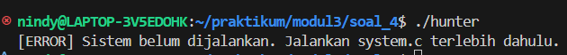

- Menjalankan hunter dan system

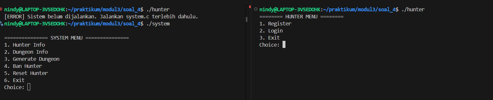

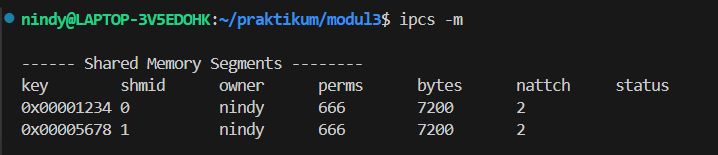

- Fitur generate dungeon

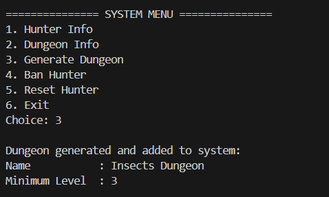

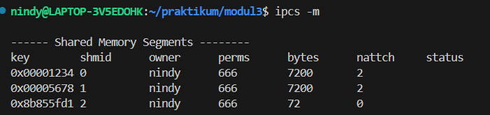

- Fitur registrasi dan login

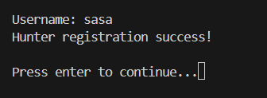

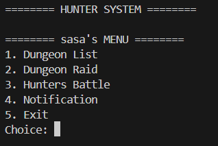

- Fitur available dan Raid dungeon

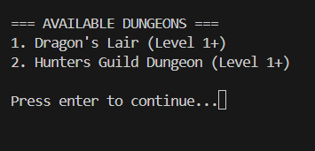

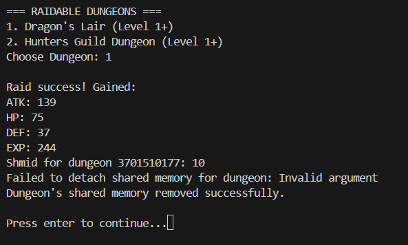

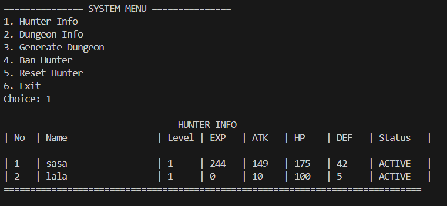

- Fitur battle

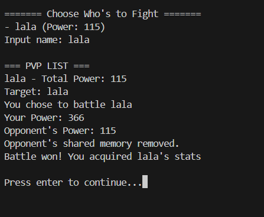

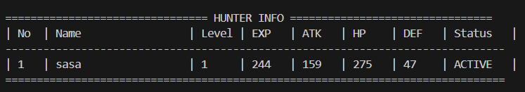

- Fitur notifikasi

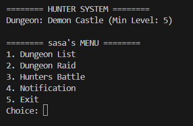

- Fitur Banned

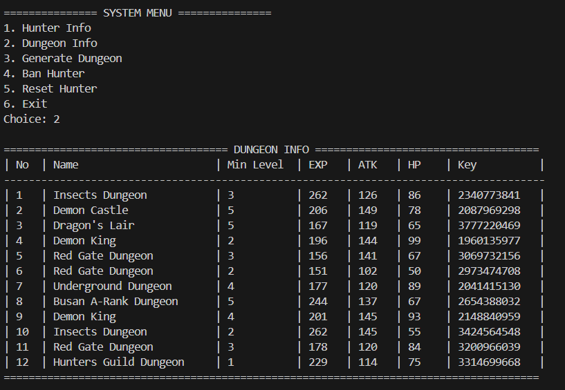

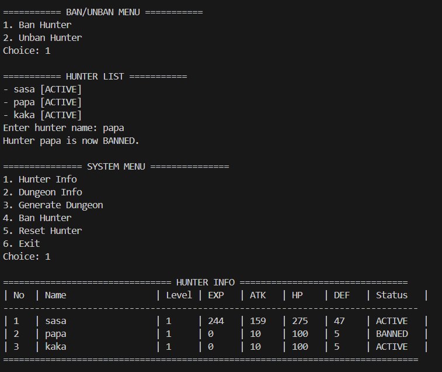

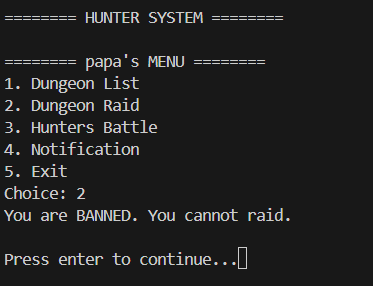

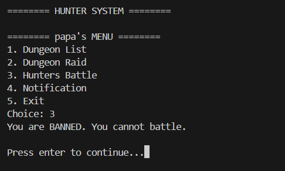

- Fitur Reset

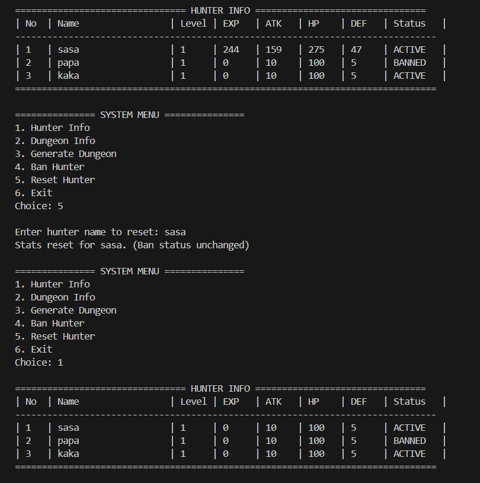

- Shared memory waktu exit

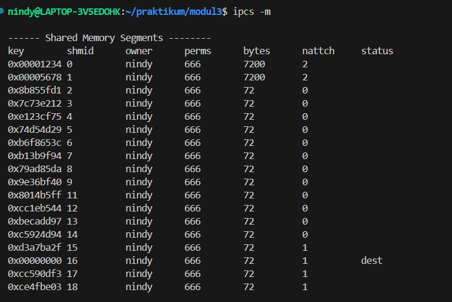

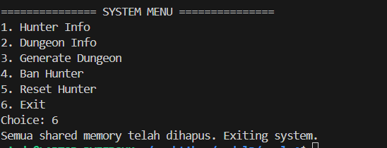

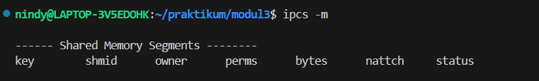
